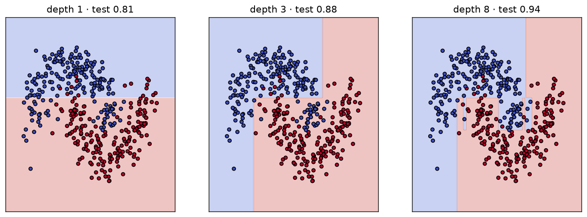
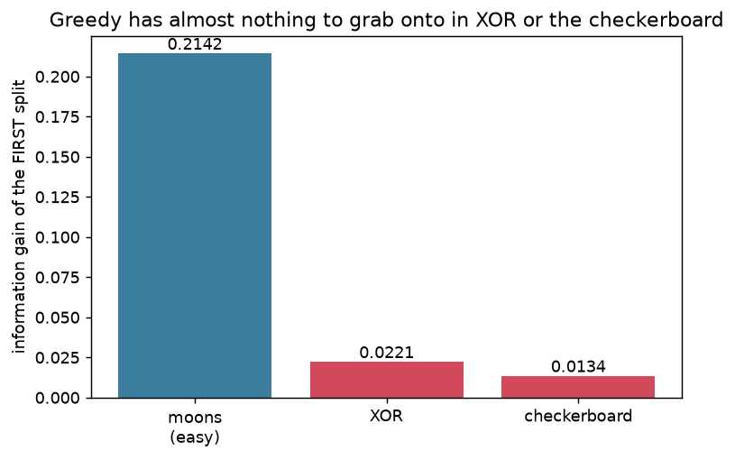
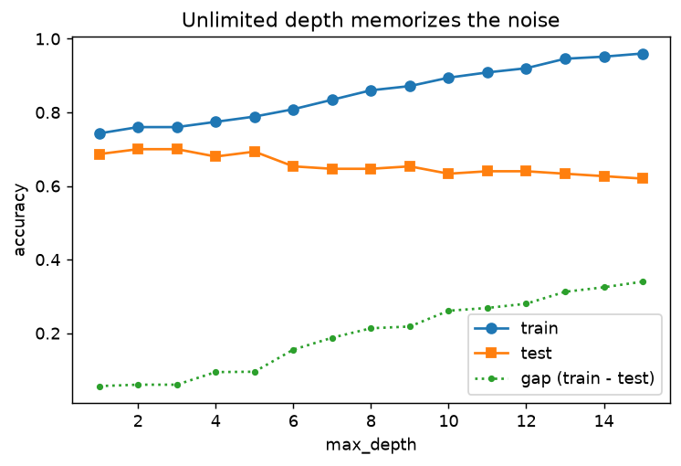

# decision_trees_101

### The greedy little algorithm inside every model you trust

A hands-on, build-it-from-scratch introduction to the **decision tree** — the base learner hiding inside random forests, gradient boosting, XGBoost, LightGBM, and CatBoost. In about eighty lines of Python you build a full recursive tree, watch it match scikit-learn on the same data, and see exactly why every ensemble hyperparameter you tune (`max_depth`, `min_samples_leaf`, `criterion`, pruning) is a decision about *this one algorithm*.

> A decision tree is built by an algorithm greedy enough to be almost embarrassing: it never plans, never looks more than one split ahead, and only ever asks whether **one feature is above or below one threshold**. Yet by stacking these trivial questions it traces the boundary of a spiral — while the same greediness leaves it stumped by XOR and prone to memorizing noise completely. Those flaws are precisely what ensembles and hyperparameters exist to manage.



---

## Quickstart

Runs on a **2-CPU / 8 GB GitHub Codespace**, no GPU. Uses [`uv`](https://docs.astral.sh/uv/).

```bash
make setup      # install uv (if needed), sync deps, register the Jupyter kernel
make test       # 18 tests: the from-scratch tree vs scikit-learn, the info-gain = MI identity
make notebooks  # execute all six notebooks (< 3 min each)
make run        # launch the Streamlit app on :8501
```

`make ci` (`sync → lint → test`) is the full gate; `make help` lists every target.

---

## The six notebooks

Read them in order — each one earns the next.

| # | Notebook | What you see | Measured result |
|---|----------|--------------|-----------------|
| 01 | [One Split](notebooks/01_one_split.ipynb) | Find the single best threshold **by hand**, then draw the one-split boundary. | Hand-picked split == the library splitter, to the last digit. |
| 02 | [Growing a Tree](notebooks/02_growing_a_tree.ipynb) | Make the split recursive; the staircase and the tree diagram grow together. | Depth 1 → 3 → 8 traces the moons ever more finely. |
| 03 | [Impurity & Information Gain](notebooks/03_impurity_and_information_gain.ipynb) | Gini vs entropy; what the tree is optimizing. | A split's information gain **equals** its mutual information (to ~1e-15). |
| 04 | [Where Greedy Fails](notebooks/04_where_greedy_fails.ipynb) | The XOR showpiece: neither feature is informative alone. | Root gain — moons **0.21**, XOR **0.02**, checkerboard **0.01**. |
| 05 | [Overfitting & Pruning](notebooks/05_overfitting_and_pruning.ipynb) | An unlimited tree wraps around each noisy point. | Unlimited: train **1.00** / test **0.65** → pruning shrinks the gap. |
| 06 | [From Tree to Forest](notebooks/06_from_tree_to_forest.ipynb) | The bridge to ensembles. | Forest solves XOR (**1.00** vs a **0.54** stump) and generalizes better on noise (**0.81** vs **0.75**). |

<p align="center">
  
  &nbsp;
  
</p>

---

## The tree you build

A real, working classifier and regressor written from scratch with NumPy — no `sklearn.tree` under the hood:

```python
from src.datasets import moons
from src.tree.classifier import DecisionTreeClassifier

X, y = moons(n_samples=400, noise=0.2, seed=42)
clf = DecisionTreeClassifier(criterion="gini", max_depth=5).fit(X, y)
clf.predict(X[:5])
```

- **`src/tree/criteria.py`** — Gini, entropy, MSE, information gain, and mutual information, each hand-checkable.
- **`src/tree/splitter.py`** — the greedy heart: best (feature, threshold) over a single sorted scan.
- **`src/tree/classifier.py`** — the ~80-line recursive tree (a shared base powers the regressor too).
- **`src/tree/prune.py`** — max-depth / min-samples / min-impurity-decrease stopping, plus cost-complexity pruning.

The test suite asserts the claims: the splitter picks the **same feature and threshold as scikit-learn**, the tree matches its **accuracy** on the same seed, information gain **equals** mutual information, and a depth limit **shrinks the train-test gap**.

---

## Repository layout

```
src/          from-scratch library: tree/ (criteria, splitter, classifier, regressor, prune),
              datasets/ (synthetic 2-D problems), evaluation/, visualisation.py, outputs.py, config.py
notebooks/    01 … 06, executed with outputs embedded
app/          streamlit_app.py — split finder, tree grower, greedy-failure demo, overfitting dial
tests/        test_criteria / test_splitter / test_classifier / test_prune
outputs/      figures/ (PNG) and data/ (JSON) — every visual and every number the notebooks produce
config/       settings.yaml — seeds and defaults
```

Every notebook figure is saved to `outputs/figures/*.png` and every textual/numerical result to `outputs/data/*.json`, so the visuals and numbers are reproducible, stable assets.

---

## Related projects

Part of a series of from-scratch ML explainers by [Dima806](https://github.com/Dima806).

**Direct sequels & prerequisites**
- [ensembles_101](https://github.com/Dima806/ensembles_101) — the sequel: forests and boosting, built from the trees you make here.
- [information_theory_101](https://github.com/Dima806/information_theory_101) — entropy, cross-entropy, and mutual information — the identity behind "information gain."
- [regularization_101](https://github.com/Dima806/regularization_101) — the idea that makes models generalize instead of memorize; pruning and depth limits are it.
- [feature_selection_arena](https://github.com/Dima806/feature_selection_arena) — why a tree's own importances mislead, and what to use instead.

**Related deep-dives**
- [bootstrap_101](https://github.com/Dima806/bootstrap_101) — resampling, the foundation of a random forest's bagging.
- [encoding_arena](https://github.com/Dima806/encoding_arena) — high-cardinality categorical features, i.e. how CatBoost and LightGBM split on categories.
- [missing_data_imputation_arena](https://github.com/Dima806/missing_data_imputation_arena) — missing values, the setting for surrogate splits and native NaN handling.
- [explainability_arena](https://github.com/Dima806/explainability_arena) — SHAP, LIME, and permutation importance vs a tree's own decision paths.

---

## References

- Breiman, Friedman, Olshen & Stone (1984). *Classification and Regression Trees* (CART).
- Quinlan (1986). *Induction of Decision Trees* (ID3, information gain).
- Hastie, Tibshirani & Friedman (2009). *The Elements of Statistical Learning*, ch. 9.
- Louppe (2014). *Understanding Random Forests: From Theory to Practice*.

## License

[Apache-2.0](LICENSE).
